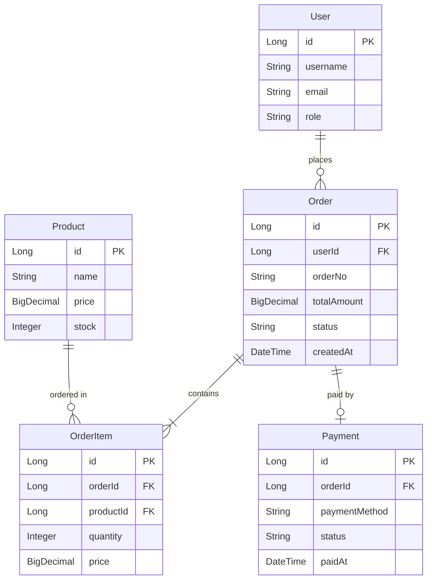
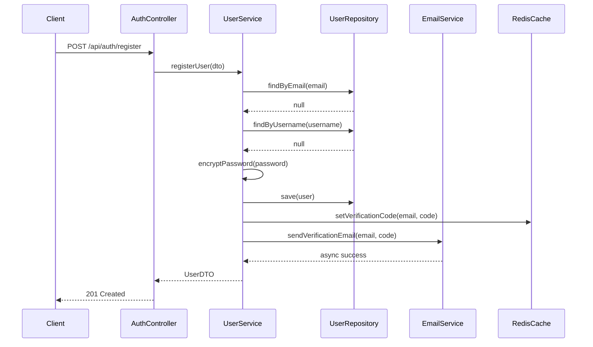
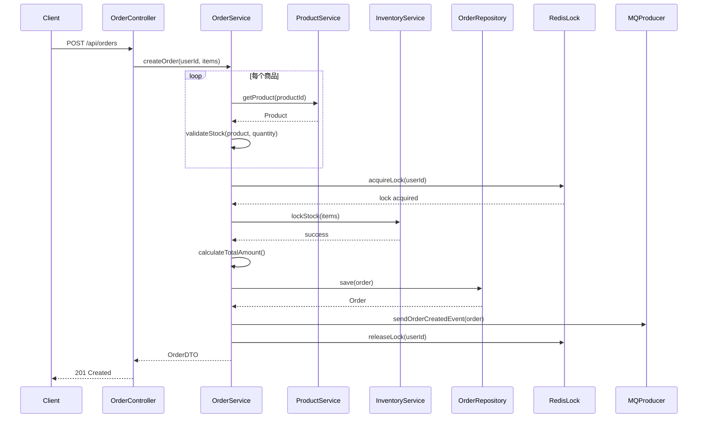
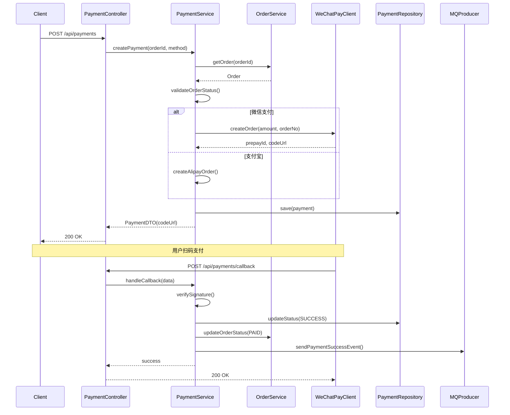
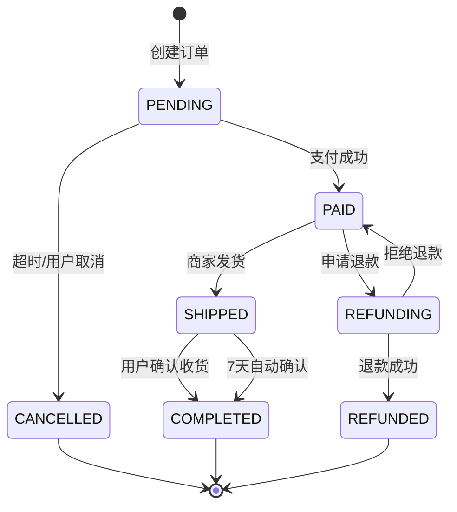

# 示例：电商订单系统 - 项目文档

> 生成时间: 2026-02-05
> 代码版本: abc123def

## 目录
- [项目简介](#项目简介)
- [核心领域模型](#核心领域模型)
- [业务流程](#业务流程)
- [项目结构](#项目结构)
- [外部依赖](#外部依赖)
- [部署说明](#部署说明)

---

## 项目简介

- **项目类型**: Web 应用 / 微服务
- **技术栈**: Spring Boot 2.7.5, MySQL 8.0, Redis 6.2
- **版本**: 1.2.0
- **构建工具**: Gradle 7.5

### 项目目标
电商订单管理系统，提供用户注册、商品浏览、订单创建、支付处理、订单跟踪等核心电商功能。支持多种支付方式，实现订单状态机管理，提供完整的订单生命周期管理。

---

## 核心领域模型

### 实体关系图


### 核心实体

#### User (用户)
- **用途**: 系统用户账户管理
- **关键字段**:
  - `id`: 用户唯一标识
  - `username`: 用户名，3-20 字符
  - `email`: 邮箱地址，需验证
  - `password`: 加密后的密码（BCrypt）
  - `role`: 用户角色（ADMIN/USER/GUEST）
  - `status`: 账户状态（ACTIVE/DISABLED/LOCKED）
- **业务规则**:
  - 用户名和邮箱必须唯一
  - 密码至少 8 位，包含字母和数字
  - 连续登录失败 5 次锁定账户
- **关联关系**:
  - 一个用户可以创建多个订单

#### Order (订单)
- **用途**: 订单信息管理
- **关键字段**:
  - `id`: 订单唯一标识
  - `orderNo`: 订单号，格式：`ORD{yyyyMMddHHmmss}{随机4位}`
  - `userId`: 下单用户 ID
  - `totalAmount`: 订单总金额
  - `status`: 订单状态（PENDING/PAID/SHIPPED/COMPLETED/CANCELLED）
  - `createdAt`: 创建时间
  - `paidAt`: 支付时间
  - `shippedAt`: 发货时间
- **业务规则**:
  - 订单创建后 30 分钟内未支付自动取消
  - 已支付订单不可取消，只能申请退款
  - 订单金额 = Σ(商品单价 × 数量)
- **关联关系**:
  - 一个订单包含多个订单项
  - 一个订单对应一个支付记录

#### Product (商品)
- **用途**: 商品信息管理
- **关键字段**:
  - `id`: 商品唯一标识
  - `name`: 商品名称
  - `description`: 商品描述
  - `price`: 商品价格
  - `stock`: 库存数量
  - `status`: 商品状态（ON_SALE/OFF_SALE/OUT_OF_STOCK）
- **业务规则**:
  - 库存不足时自动下架
  - 价格变更不影响已创建订单
  - 支持库存预占机制（创建订单时锁定库存）
- **关联关系**:
  - 一个商品可以出现在多个订单项中

#### OrderItem (订单项)
- **用途**: 订单明细管理
- **关键字段**:
  - `id`: 订单项唯一标识
  - `orderId`: 所属订单 ID
  - `productId`: 商品 ID
  - `quantity`: 购买数量
  - `price`: 下单时的商品单价（快照）
- **业务规则**:
  - 记录下单时的商品价格，不受后续价格变动影响
  - 数量必须大于 0
- **关联关系**:
  - 属于一个订单
  - 关联一个商品

#### Payment (支付)
- **用途**: 支付记录管理
- **关键字段**:
  - `id`: 支付唯一标识
  - `orderId`: 关联订单 ID
  - `paymentMethod`: 支付方式（WECHAT/ALIPAY/BALANCE）
  - `transactionId`: 第三方支付流水号
  - `amount`: 支付金额
  - `status`: 支付状态（PENDING/SUCCESS/FAILED/REFUNDED）
  - `paidAt`: 支付完成时间
- **业务规则**:
  - 支付金额必须等于订单总金额
  - 支付成功后更新订单状态
  - 支持部分退款和全额退款
- **关联关系**:
  - 一个支付记录对应一个订单

---

## 业务流程

### 1. 用户注册流程


**关键步骤说明**:
1. **邮箱和用户名唯一性检查**: 防止重复注册
2. **密码加密**: 使用 BCrypt 加密，盐值自动生成
3. **验证码生成**: 6 位随机数字，5 分钟有效期
4. **异步发送邮件**: 使用 `@Async` 异步发送，不阻塞主流程
5. **事务管理**: 用户保存在事务中，邮件发送失败不回滚

**异常处理**:
- `EmailAlreadyExistsException`: 邮箱已被注册 (400)
- `UsernameAlreadyExistsException`: 用户名已存在 (400)
- `EmailSendFailureException`: 邮件发送失败（记录日志，返回成功）

---

### 2. 创建订单流程


**关键步骤说明**:
1. **商品验证**: 检查商品是否存在、是否在售、库存是否充足
2. **分布式锁**: 使用 Redis 分布式锁防止用户重复下单
3. **库存锁定**: 预占库存，30 分钟后自动释放（如未支付）
4. **金额计算**: 使用 BigDecimal 精确计算，避免浮点误差
5. **订单号生成**: `ORD + 时间戳 + 随机数`，保证唯一性
6. **消息发送**: 发送订单创建事件到 MQ，触发后续流程（发送通知、统计等）

**业务规则**:
- 单次下单最多 20 个商品
- 单个商品最多购买 99 件
- 订单金额最低 0.01 元

**异常处理**:
- `ProductNotFoundException`: 商品不存在 (404)
- `InsufficientStockException`: 库存不足 (400)
- `DuplicateOrderException`: 重复下单 (409)

---

### 3. 支付流程


**关键步骤说明**:
1. **订单状态验证**: 只有 PENDING 状态的订单可以支付
2. **调用支付网关**: 根据支付方式调用对应的第三方接口
3. **预支付订单**: 创建支付记录，状态为 PENDING
4. **回调处理**: 验证签名，更新支付和订单状态
5. **幂等性保证**: 使用 transactionId 防止重复处理回调

**业务规则**:
- 订单创建后 30 分钟内必须完成支付
- 支付金额必须与订单金额一致
- 支持重复支付（前一次失败的情况）

**异常处理**:
- `OrderNotFoundException`: 订单不存在 (404)
- `InvalidOrderStatusException`: 订单状态不允许支付 (400)
- `PaymentGatewayException`: 支付网关调用失败 (502)
- `SignatureVerificationException`: 回调签名验证失败 (400)

---

### 4. 订单状态机


**状态说明**:
- `PENDING`: 待支付，30 分钟后自动取消
- `PAID`: 已支付，等待发货
- `SHIPPED`: 已发货，等待确认收货
- `COMPLETED`: 已完成，订单结束
- `CANCELLED`: 已取消
- `REFUNDING`: 退款中
- `REFUNDED`: 已退款

---

## 项目结构

### 架构模式
本项目采用 **分层架构** + **领域驱动设计（DDD）** 模式，清晰分离业务逻辑和基础设施。

### 目录结构
```
src/main/java/com/example/ecommerce/
├── controller/              # 控制器层 - 处理 HTTP 请求
│   ├── AuthController.java
│   ├── OrderController.java
│   ├── PaymentController.java
│   └── ProductController.java
├── service/                 # 服务层 - 业务逻辑
│   ├── UserService.java
│   ├── OrderService.java
│   ├── PaymentService.java
│   ├── ProductService.java
│   └── impl/
│       ├── UserServiceImpl.java
│       └── OrderServiceImpl.java
├── repository/              # 数据访问层
│   ├── UserRepository.java
│   ├── OrderRepository.java
│   └── ProductRepository.java
├── entity/                  # 实体类 - 领域模型
│   ├── User.java
│   ├── Order.java
│   ├── OrderItem.java
│   ├── Product.java
│   └── Payment.java
├── dto/                     # 数据传输对象
│   ├── request/
│   │   ├── CreateOrderRequest.java
│   │   └── RegisterRequest.java
│   └── response/
│       ├── OrderResponse.java
│       └── UserResponse.java
├── config/                  # 配置类
│   ├── SecurityConfig.java
│   ├── RedisConfig.java
│   ├── MybatisConfig.java
│   └── AsyncConfig.java
├── exception/               # 异常定义
│   ├── GlobalExceptionHandler.java
│   ├── BusinessException.java
│   └── ErrorCode.java
├── util/                    # 工具类
│   ├── JwtUtil.java
│   ├── RedisUtil.java
│   └── DateUtil.java
├── aspect/                  # AOP 切面
│   ├── LogAspect.java
│   └── RateLimitAspect.java
├── mq/                      # 消息队列
│   ├── producer/
│   │   └── OrderEventProducer.java
│   └── consumer/
│       └── OrderEventConsumer.java
└── client/                  # 外部服务客户端
    ├── WeChatPayClient.java
    └── AlipayClient.java

src/main/resources/
├── application.yml          # 主配置文件
├── application-dev.yml      # 开发环境配置
├── application-prod.yml     # 生产环境配置
├── mapper/                  # MyBatis Mapper XML
│   ├── UserMapper.xml
│   └── OrderMapper.xml
└── db/
    └── migration/           # 数据库迁移脚本
        ├── V1__init.sql
        └── V2__add_payment.sql
```

### 模块说明

#### Controller 层
- **职责**: 接收 HTTP 请求，参数验证，调用 Service，返回响应
- **规范**:
  - 使用 `@RestController` 注解
  - 统一返回 `Result<T>` 包装类
  - 使用 `@Valid` 进行参数校验
  - 不包含业务逻辑，只做参数转换和结果包装

#### Service 层
- **职责**: 核心业务逻辑，事务管理，调用多个 Repository
- **规范**:
  - 接口与实现分离（`UserService` + `UserServiceImpl`）
  - 使用 `@Transactional` 管理事务
  - 避免直接操作 Entity，使用 DTO 传递数据
  - 一个 Service 方法对应一个完整的业务用例

#### Repository 层
- **职责**: 数据持久化，数据库操作
- **规范**:
  - 继承 `JpaRepository` 或定义 MyBatis `Mapper`
  - 只包含数据访问逻辑，不包含业务逻辑
  - 方法命名遵循 Spring Data JPA 规范

#### Entity 层
- **职责**: 领域模型，映射数据库表
- **规范**:
  - 使用 JPA 注解（`@Entity`, `@Table`, `@Column`）
  - 包含业务验证逻辑（如 `isExpired()`, `canBeCancelled()`）
  - 避免循环引用（使用 `@JsonIgnore`）

---

## 外部依赖

### 核心框架依赖

| 依赖 | 版本 | 用途 |
|------|------|------|
| Spring Boot | 2.7.5 | 应用框架 |
| Spring Security | 2.7.5 | 安全认证、JWT |
| Spring Data JPA | 2.7.5 | 数据访问、ORM |
| Spring AMQP | 2.7.5 | RabbitMQ 集成 |

### 数据存储

| 技术 | 版本 | 用途 |
|------|------|------|
| MySQL | 8.0 | 主数据库 |
| Redis | 6.2 | 缓存、分布式锁、会话存储 |
| Elasticsearch | 7.17 | 商品全文搜索 |

### 第三方服务

#### 微信支付
- **用途**: 支付处理
- **配置**: `application.yml` 中的 `wechat.pay.*`
- **使用位置**: `WeChatPayClient.java`
- **文档**: https://pay.weixin.qq.com/wiki/doc/api/

#### 阿里云 OSS
- **用途**: 商品图片存储
- **配置**: `application.yml` 中的 `aliyun.oss.*`
- **使用位置**: `FileService.java`

#### 阿里云短信
- **用途**: 发送验证码、订单通知
- **配置**: `application.yml` 中的 `aliyun.sms.*`
- **使用位置**: `SmsService.java`

### 工具库

| 依赖 | 版本 | 用途 |
|------|------|------|
| Lombok | 1.18.24 | 简化 Java 代码（@Data, @Builder） |
| Hutool | 5.8.10 | Java 工具类库 |
| Jackson | 2.13.4 | JSON 序列化/反序列化 |
| Guava | 31.1 | 集合工具、缓存 |
| MapStruct | 1.5.3 | Entity 与 DTO 转换 |

### 开发和测试

| 依赖 | 版本 | 用途 |
|------|------|------|
| JUnit 5 | 5.9.1 | 单元测试 |
| Mockito | 4.8.0 | Mock 框架 |
| SpringDoc OpenAPI | 1.6.12 | API 文档生成（Swagger UI） |
| H2 Database | 2.1.214 | 测试数据库 |

---

## 部署说明

### 环境要求
- Java 11+
- MySQL 8.0+
- Redis 6.2+
- RabbitMQ 3.9+

### 配置说明

1. **数据库初始化**
   ```bash
   mysql -u root -p < db/migration/V1__init.sql
   ```

2. **配置文件**
   复制 `application-example.yml` 为 `application-prod.yml`，修改：
   ```yaml
   spring:
     datasource:
       url: jdbc:mysql://localhost:3306/ecommerce?useSSL=false
       username: your_username
       password: your_password

     redis:
       host: localhost
       port: 6379
       password: your_redis_password

   wechat:
     pay:
       appId: your_app_id
       mchId: your_mch_id
       apiKey: your_api_key
   ```

### 启动步骤

```bash
# 构建
./gradlew clean build

# 运行
java -jar build/libs/ecommerce-1.2.0.jar --spring.profiles.active=prod

# 或使用 Docker
docker-compose up -d
```

### 健康检查
```bash
curl http://localhost:8080/actuator/health
```

---

## 文档维护

本文档由 AI 自动生成，基于代码库快照。

**更新文档**:
当代码有重大变更时，调用相关命令让 AI 重新生成文档

**手动维护**:
- 业务背景和决策原因需要手动补充
- 架构演进历史需要手动记录
- 性能优化建议需要手动添加
