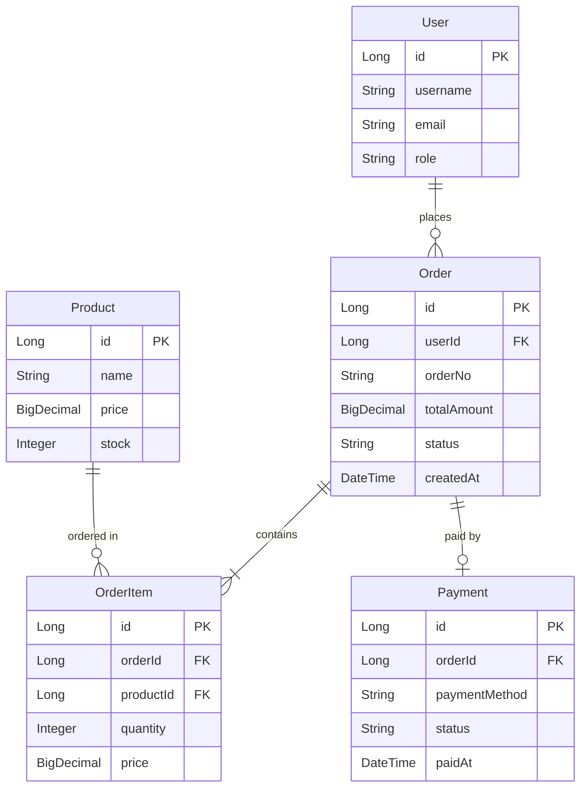
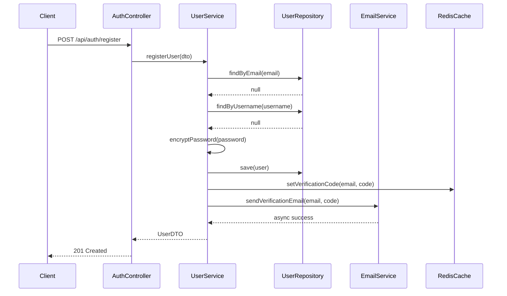
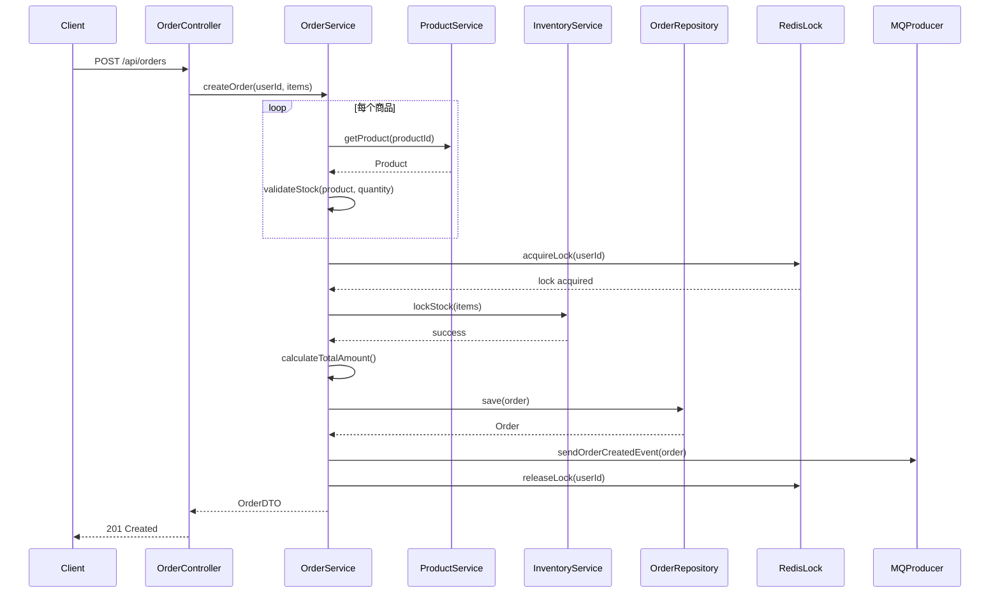
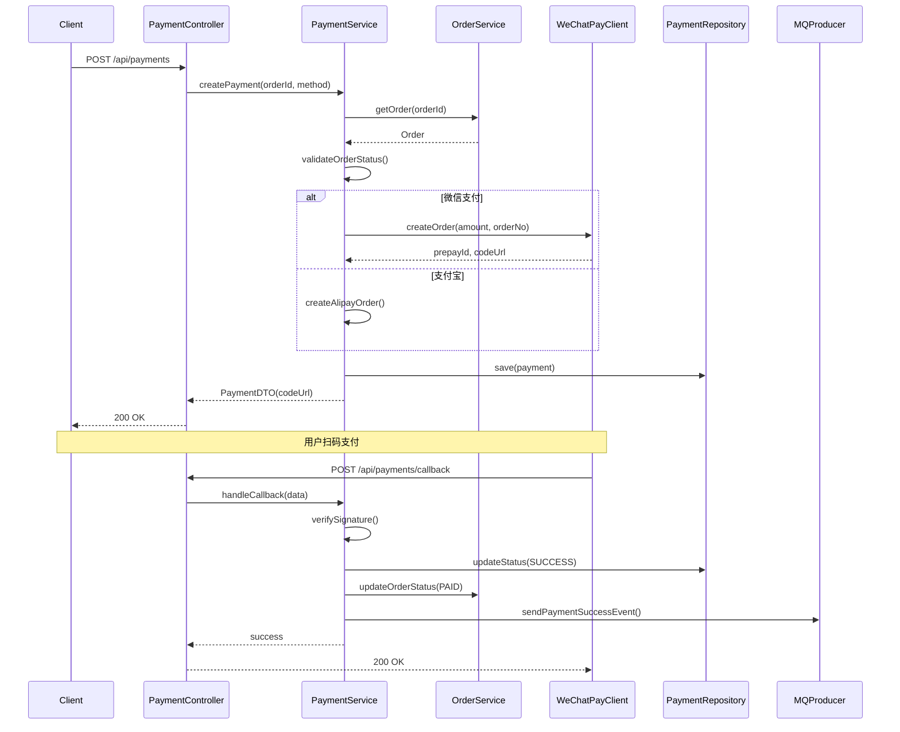

> ⚠️ **虚构示例** — 本文件内容**全部虚构**，仅用于展示文档结构、字段命名、Mermaid 语法、来源标注方式。
> 不要照搬任何具体值（版本号、业务规则、文件路径、行号、第三方服务）。实际文档每一条内容必须来自真实代码库，找不到来源的写 `待补充（需人工确认）`。遵守 SKILL.md Step 6.0 数据来源原则。
>
> ⚠️ **单文件展示** — 本示例为便于阅读合并在一个文件中展示。**实际生成时会拆分为两层结构**：
> - 项目层 `docs/project-overview/`（6 个文件）：`README.md` / `architecture.md` / `milestones.md` / `dependencies.md` / `deployment.md` / `development.md`
> - 领域层 `docs/domains/<域>/`：每个业务域一个子目录，小域单文件、大域拆 `README.md + domain-model.md + flows.md`
>
> 本示例的"业务流程"与"领域模型"章节在实际产出中会按域归属：每个实体归属唯一一个域、每个流程归属唯一一个域（发起方/消费方/编排方），跨域关系通过相对链接表达。完整拆分骨架与模板见 `references/output-templates.md` 的 Step 6。
>
> ---

<!-- DOC_META: last_commit=abc123def456, generated=2026-02-05 -->

# 示例：电商订单系统 - 项目文档

> 生成时间: 2026-02-05
> 代码版本: abc123def456
> ⚠️ 以下内容为虚构示例，仅用于展示格式

## 目录
- [项目简介](#项目简介)
- [核心领域模型](#核心领域模型)
- [业务流程](#业务流程)
- [项目结构](#项目结构)
- [外部依赖](#外部依赖)
- [部署说明](#部署说明)
- [开发指南](#开发指南)

---

## 项目简介

- **项目类型**: Web 应用 / 单体服务
- **技术栈**: Spring Boot 2.7.5, MySQL 8.0, Redis 6.2（来源: `build.gradle`、`application.yml`）
- **版本**: 1.2.0（来源: `build.gradle` `version`）
- **构建工具**: Gradle 7.5（来源: `gradle/wrapper/gradle-wrapper.properties`）

### 项目目标
电商订单管理系统，提供用户注册、商品浏览、订单创建、支付处理、订单跟踪等核心电商功能。[推断] 依据: 顶层 Controller 路径 `/api/auth`、`/api/orders`、`/api/payments` 及 README 描述。

---

## 核心领域模型

### 实体关系图


### 核心实体

#### User (用户)
- **用途**: 系统用户账户管理
- **来源文件**: `entity/User.java`
- **关键字段**:
  - `id`: 用户唯一标识
  - `username`: 用户名
  - `email`: 邮箱地址
  - `password`: 密码（加密存储）
  - `role`: 用户角色（ADMIN/USER/GUEST）
  - `status`: 账户状态（ACTIVE/DISABLED/LOCKED）
- **业务规则**（仅列出代码中可验证的规则）:
  - 用户名和邮箱必须唯一（来源: `@Column(unique = true)` on `username`, `email`）
  - 密码长度和复杂度校验（来源: `RegisterRequest.java` `@Pattern` 注解）
  - 账户锁定机制（来源: `LoginFailureCounter.java` + `User.status` 字段）
- **关联关系**:
  - 一个用户可以创建多个订单（`@OneToMany(mappedBy = "user")`）

#### Order (订单)
- **用途**: 订单信息管理
- **来源文件**: `entity/Order.java`
- **关键字段**:
  - `id`: 订单唯一标识
  - `orderNo`: 订单号（来源: `OrderNoGenerator.java`）
  - `userId`: 下单用户 ID
  - `totalAmount`: 订单总金额
  - `status`: 订单状态（PENDING/PAID/SHIPPED/COMPLETED/CANCELLED）
  - `createdAt` / `paidAt` / `shippedAt`: 时间戳
- **业务规则**（仅列出代码中可验证的规则）:
  - 超时未支付自动取消（来源: `OrderTimeoutJob.java` `@Scheduled`）
  - 已支付订单不可取消（来源: `OrderService.cancel():32`, 状态校验 `if (status != PENDING)`）
  - 订单金额 = Σ(商品单价 × 数量)（来源: `OrderService.calculateTotalAmount():78`）
- **关联关系**:
  - 一个订单包含多个订单项（`@OneToMany`）
  - 一个订单对应一个支付记录（`@OneToOne`）

#### Product (商品)
- **用途**: 商品信息管理
- **来源文件**: `entity/Product.java`
- **关键字段**:
  - `id`, `name`, `description`, `price`, `stock`
  - `status`: 商品状态（ON_SALE/OFF_SALE/OUT_OF_STOCK）
- **业务规则**（仅列出代码中可验证的规则）:
  - 库存为 0 时自动下架（来源: `ProductService.updateStock():45`）
  - 库存预占机制（来源: `InventoryService.lockStock()`）
- **关联关系**:
  - 一个商品可以出现在多个订单项中

#### OrderItem (订单项)
- **用途**: 订单明细
- **来源文件**: `entity/OrderItem.java`
- **关键字段**:
  - `id`, `orderId`, `productId`, `quantity`
  - `price`: 下单时的商品单价快照
- **业务规则**:
  - 记录下单时的商品价格，不受后续价格变动影响（来源: 字段 `price` 独立存储）
  - 数量必须大于 0（来源: `@Min(1)` 注解）
- **关联关系**:
  - 属于一个订单；关联一个商品

#### Payment (支付)
- **用途**: 支付记录管理
- **来源文件**: `entity/Payment.java`
- **关键字段**:
  - `id`, `orderId`, `paymentMethod`, `transactionId`, `amount`
  - `status`: 支付状态（PENDING/SUCCESS/FAILED/REFUNDED）
  - `paidAt`: 支付完成时间
- **业务规则**:
  - 支付金额必须等于订单金额（来源: `PaymentService.validate():28`）
  - 支持部分退款（来源: `RefundService.partialRefund()`）
- **关联关系**:
  - 一个支付记录对应一个订单

---

## 业务流程

### 用户注册流程

**入口**: `AuthController.register()` (POST /api/auth/register)



**关键步骤说明**（仅记录代码中可追踪的逻辑）:
1. **邮箱和用户名唯一性检查**: 来源 `UserService.java:45`
2. **密码加密**: 使用 BCrypt，来源 `UserService.java:52`（`passwordEncoder.encode()`）
3. **验证码生成**: 来源 `VerificationCodeGenerator.java`
4. **异步发送邮件**: 来源 `EmailService.java` 的 `@Async` 注解
5. **事务管理**: 来源 `UserService.registerUser()` 的 `@Transactional` 注解

**异常处理**（来源: `GlobalExceptionHandler` 及方法签名）:
- `EmailAlreadyExistsException`: 邮箱已被注册 (400)
- `UsernameAlreadyExistsException`: 用户名已存在 (400)
- `EmailSendFailureException`: 邮件发送失败（记录日志，返回成功）

---

### 创建订单流程

**入口**: `OrderController.createOrder()` (POST /api/orders)



**关键步骤说明**（仅记录代码中可追踪的逻辑）:
1. **商品验证**: 来源 `OrderService.java:62`（遍历 items 调用 `productService.getProduct()`）
2. **分布式锁**: 来源 `OrderService.java:78`（`redisLock.acquireLock(userId)`）
3. **库存锁定**: 来源 `InventoryService.lockStock():34`
4. **金额计算**: 来源 `OrderService.calculateTotalAmount():92`（使用 `BigDecimal`）
5. **订单号生成**: 来源 `OrderNoGenerator.generate()`
6. **消息发送**: 来源 `OrderService.java:115`（`mqProducer.sendOrderCreatedEvent()`）

**异常处理**（来源: `GlobalExceptionHandler`）:
- `ProductNotFoundException`: 商品不存在 (404)
- `InsufficientStockException`: 库存不足 (400)
- `DuplicateOrderException`: 重复下单 (409)

---

### 支付流程

**入口**: `PaymentController.createPayment()` (POST /api/payments) + `PaymentController.handleCallback()` (POST /api/payments/callback)



**关键步骤说明**（仅记录代码中可追踪的逻辑）:
1. **订单状态验证**: 来源 `PaymentService.validateOrderStatus():22`（仅允许 PENDING）
2. **调用支付网关**: 来源 `PaymentService.createPayment():45`（分支由 `method` 字段决定）
3. **回调签名验证**: 来源 `PaymentService.verifySignature():88`
4. **幂等性保证**: 来源 `PaymentService.handleCallback():102`（按 `transactionId` 查重）

**异常处理**（来源: `GlobalExceptionHandler`）:
- `OrderNotFoundException`: 订单不存在 (404)
- `InvalidOrderStatusException`: 订单状态不允许支付 (400)
- `PaymentGatewayException`: 支付网关调用失败 (502)
- `SignatureVerificationException`: 回调签名验证失败 (400)

---

### 订单状态机

**来源**: `OrderStatusMachine.java` + `OrderService` 中的状态转换调用


**状态说明**（来源: `OrderStatus.java` 枚举）:
- `PENDING`: 待支付
- `PAID`: 已支付，等待发货
- `SHIPPED`: 已发货，等待确认收货
- `COMPLETED`: 已完成
- `CANCELLED`: 已取消
- `REFUNDING`: 退款中
- `REFUNDED`: 已退款

---

## 项目结构

### 架构模式
本项目采用 **分层架构** + **领域驱动设计（DDD）** 模式。
**判断依据**: 顶层包命名（`controller/`、`service/`、`repository/`、`entity/`）+ 实体层包含业务方法（如 `Order.canBeCancelled()`）+ 接口实现分离（`UserService` + `UserServiceImpl`）。

### 目录结构
```
src/main/java/com/example/ecommerce/
├── controller/              # 控制器层 - 处理 HTTP 请求
│   ├── AuthController.java
│   ├── OrderController.java
│   ├── PaymentController.java
│   └── ProductController.java
├── service/                 # 服务层 - 业务逻辑
│   ├── UserService.java
│   ├── OrderService.java
│   ├── PaymentService.java
│   └── impl/
│       ├── UserServiceImpl.java
│       └── OrderServiceImpl.java
├── repository/              # 数据访问层
│   ├── UserRepository.java
│   ├── OrderRepository.java
│   └── ProductRepository.java
├── entity/                  # 实体类 - 领域模型
│   ├── User.java
│   ├── Order.java
│   ├── OrderItem.java
│   ├── Product.java
│   └── Payment.java
├── dto/                     # 数据传输对象
│   ├── request/
│   └── response/
├── config/                  # 配置类
│   ├── SecurityConfig.java
│   ├── RedisConfig.java
│   └── AsyncConfig.java
├── exception/               # 异常定义
│   ├── GlobalExceptionHandler.java
│   └── BusinessException.java
├── util/                    # 工具类
├── aspect/                  # AOP 切面
├── mq/                      # 消息队列
└── client/                  # 外部服务客户端
    ├── WeChatPayClient.java
    └── AlipayClient.java

src/main/resources/
├── application.yml
├── application-dev.yml
├── application-prod.yml
├── mapper/                  # MyBatis Mapper XML
└── db/migration/            # 数据库迁移脚本
```

### 模块说明

#### Controller 层
- **职责**: 接收 HTTP 请求、参数验证、调用 Service、返回响应
- **规范**（从代码归纳）:
  - 使用 `@RestController`
  - 统一返回 `Result<T>` 包装类（来源: `common/Result.java`）
  - 使用 `@Valid` 进行参数校验

#### Service 层
- **职责**: 核心业务逻辑、事务管理
- **规范**（从代码归纳）:
  - 接口与实现分离（`XxxService` + `XxxServiceImpl`）
  - 使用 `@Transactional` 管理事务
  - 入参出参使用 DTO，不直接暴露 Entity

#### Repository 层
- **职责**: 数据持久化
- **规范**（从代码归纳）:
  - 继承 `JpaRepository`
  - 复杂查询通过 `@Query` 或 MyBatis Mapper

#### Entity 层
- **职责**: 领域模型，映射数据库表
- **规范**（从代码归纳）:
  - 使用 JPA 注解（`@Entity`, `@Table`, `@Column`）
  - 包含业务方法（如 `Order.canBeCancelled()`、`Order.isExpired()`）

---

## 外部依赖

### 核心框架依赖

| 依赖 | 版本 | 用途 |
|------|------|------|
| Spring Boot | 2.7.5 | 应用框架 |
| Spring Security | 2.7.5 | 安全认证、JWT |
| Spring Data JPA | 2.7.5 | 数据访问、ORM |
| Spring AMQP | 2.7.5 | RabbitMQ 集成 |

### 数据存储

| 技术 | 版本 | 用途 |
|------|------|------|
| MySQL | 8.0 | 主数据库（来源: `application.yml` `datasource.url`） |
| Redis | 6.2 | 缓存、分布式锁、会话（来源: `application.yml` `redis.*`） |
| Elasticsearch | 7.17 | 商品全文搜索（来源: `application.yml` `elasticsearch.*`） |

### 第三方服务

#### 微信支付
- **用途**: 支付处理
- **配置**: `application.yml` 中的 `wechat.pay.*`
- **使用位置**: `client/WeChatPayClient.java`

#### 阿里云 OSS
- **用途**: 商品图片存储
- **配置**: `application.yml` 中的 `aliyun.oss.*`
- **使用位置**: `service/FileService.java`

#### 阿里云短信
- **用途**: 发送验证码、订单通知
- **配置**: `application.yml` 中的 `aliyun.sms.*`
- **使用位置**: `service/SmsService.java`

### 工具库

| 依赖 | 版本 | 用途 |
|------|------|------|
| Lombok | 1.18.24 | 简化 Java 代码 |
| Hutool | 5.8.10 | Java 工具类库 |
| Jackson | 2.13.4 | JSON 序列化 |
| MapStruct | 1.5.3 | Entity 与 DTO 转换 |

### 开发和测试

| 依赖 | 版本 | 用途 |
|------|------|------|
| JUnit 5 | 5.9.1 | 单元测试 |
| Mockito | 4.8.0 | Mock 框架 |
| SpringDoc OpenAPI | 1.6.12 | API 文档生成 |
| H2 Database | 2.1.214 | 测试数据库 |

---

## 部署说明

> 以下内容基于项目中的构建文件、Dockerfile、CI 配置和 README 提取。未找到来源的条目标注为「待补充」。

### 环境要求
- Java 11（来源: `build.gradle` `sourceCompatibility = '11'`）
- MySQL 8.0+（来源: `docker-compose.yml` service `mysql:8.0`）
- Redis 6.2+（来源: `docker-compose.yml` service `redis:6.2-alpine`）
- RabbitMQ 3.9+（来源: `docker-compose.yml` service `rabbitmq:3.9-management`）

### 配置说明
复制 `src/main/resources/application-example.yml` 为 `application-prod.yml`，按下列 key 填写（来源: `application-example.yml`）：

```yaml
spring:
  datasource:
    url: jdbc:mysql://localhost:3306/ecommerce
    username: <your_username>
    password: <your_password>
  redis:
    host: localhost
    port: 6379
    password: <your_redis_password>

wechat:
  pay:
    appId: <your_app_id>
    mchId: <your_mch_id>
    apiKey: <your_api_key>
```

### 启动步骤

来源: `README.md#运行` + `docker-compose.yml`

```bash
# 方式一：本地构建运行
./gradlew clean build
java -jar build/libs/ecommerce-1.2.0.jar --spring.profiles.active=prod

# 方式二：Docker
docker-compose up -d
```

### 健康检查

```bash
curl http://localhost:8080/actuator/health
```

来源: `application.yml` `management.endpoints.web.exposure.include=health,...`

---

## 开发指南

> ⚠️ 本节多为团队规范，代码库中通常不完整。只写能从 `CONTRIBUTING.md`、lint 配置、git hooks、CI 等读出的事实，其余写「待补充」。

### 本地开发环境搭建
来源: `README.md#开发`
1. 安装 Java 11、Docker、Docker Compose
2. `docker-compose -f docker-compose.dev.yml up -d` 启动依赖中间件
3. `./gradlew bootRun --args='--spring.profiles.active=dev'`

### 代码规范
来源: `config/checkstyle.xml` + `.editorconfig`
- 缩进：4 空格
- 行宽：120
- 导入顺序：java → javax → org → com
- 其他细节：待补充（团队 wiki）

### 提交规范
待补充（代码库中未发现 `commitlint.config.js` / `.gitmessage` / `CONTRIBUTING.md` 的提交规范章节）

### 常见问题
来源: `README.md#FAQ`
- **Q: 启动时报数据库连接失败？** A: 检查 `application-dev.yml` 中的数据库配置
- **Q: Redis 连接超时？** A: 确认 Docker 容器已启动 (`docker ps`)

---

## 文档维护

本文档由 AI 自动生成，基于代码库快照。

**更新文档**:
当代码有重大变更时，重新调用 document-project skill 增量或全量更新。

**手动维护**:
- 业务背景和决策原因需要手动补充
- 架构演进历史需要手动记录
- 性能优化建议需要手动添加
